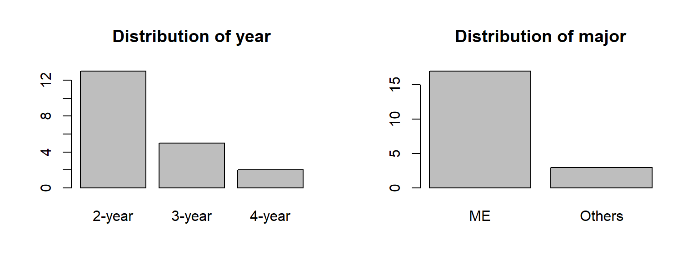

# Page-L01 HOME

<figure><figcaption></figcaption></figure>

## # 1.1 기술통계 소개

기술통계(descriptive statistics) 분석은 **모집단**의 특성을 분석자가 한눈에 파악할 수 있도록 데이터를 정리하고 표현하는 방법이다. 표 [1.1](https://kilhwan.github.io/bizstat-book/ch-statisics.html#tab:classDataIntro)처럼 한 강의를 수강하고 있는 20명의 학생의 명단이 있다고 하자. 이 명단을 훑어보는 것만으로 20명의 학생들의 특성을 파악하기는 어렵다. 만약 20명의 학생들의 남녀 분포에 대한 표가 주어져 있고 (표 [1.2](https://kilhwan.github.io/bizstat-book/ch-statisics.html#tab:classGenderDist)), 학년별 분포 및 전공 분포에 대한 막대그래프가 그려져 있다면 (그림 [1.1](https://kilhwan.github.io/bizstat-book/ch-statisics.html#fig:classDist)), 강의를 듣는 학생의 특성을 좀 더 쉽게 파악할 수 있을 것이다.

Table 1.2: 성별 분포 gender count F 8 M 12

| gender | count |
| ------ | ----- |
| F      | 8     |
| M      | 12    |

<figure><figcaption>
Figure 1.1: 수강생 학년 및 전공 분포
</figcaption></figure>

